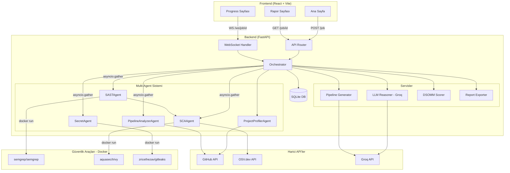

# Mimari Dokümantasyon

## Genel Bakış

DevSecOps AI, kullanıcıların GitHub repolarını güvenlik açısından analiz etmesini, CI/CD pipeline'larını değerlendirmesini ve projeye özel pipeline YAML'ı otomatik üretmesini sağlayan bir web uygulamasıdır.

Sistem **standalone** çalışır — analiz edilen repoların CI/CD pipeline'ı içinde değil, dışarıdan bir asistan olarak.

---

## Bileşen Diyagramı



---

## Sequence Diyagramı — Tam Analiz Akışı

```mermaid
sequenceDiagram
    actor User
    participant FE as Frontend
    participant API as FastAPI
    participant ORC as Orchestrator
    participant PP as ProjectProfiler
    participant PAR as Paralel Agents
    participant LLM as Groq LLM
    participant WS as WebSocket

    User->>FE: GitHub URL gir, Tam Analiz tıkla
    FE->>API: POST /job {repo_url, platform}
    API-->>FE: {job_id, ws_url} (202)
    FE->>WS: WebSocket bağlan /ws/{job_id}

    FE->>FE: /progress/{job_id} sayfasına git

    Note over ORC: BackgroundTask başlar
    API->>ORC: orchestrator.run(job_id, repo_url)

    ORC->>WS: job_started
    ORC->>PP: execute(state)
    PP->>PP: analyze_repo() → dil, framework, file_list
    PP-->>ORC: AgentResult{profile, file_list}
    ORC->>WS: agent_completed{project_profiler}

    ORC->>ORC: download_repo() → temp_dir

    par Paralel Agent'lar
        ORC->>PAR: SASTAgent.execute(state)
        Note over PAR: Bandit + Semgrep (Docker)
    and
        ORC->>PAR: SCAAgent.execute(state)
        Note over PAR: OSV.dev + Trivy (Docker)
    and
        ORC->>PAR: SecretAgent.execute(state)
        Note over PAR: Gitleaks (Docker)
    and
        ORC->>PAR: PipelineAnalyzerAgent.execute(state)
        Note over PAR: .github/workflows/* analiz
    end

    PAR-->>ORC: 4x AgentResult
    ORC->>WS: 4x agent_completed

    ORC->>LLM: bulgular → Groq → risk özeti
    LLM-->>ORC: llm_summary

    ORC->>LLM: profil + bulgular → Groq → YAML
    LLM-->>ORC: pipeline_yaml

    ORC->>ORC: calculate_dsomm() → 5 kategori skor
    ORC->>ORC: DB'ye kaydet (Job.result)
    ORC->>WS: job_completed{score, level}

    WS-->>FE: job_completed event
    FE->>API: GET /job/{job_id}
    API-->>FE: {result: {dsomm, findings, yaml, ...}}
    FE->>FE: /result sayfasına git
    FE-->>User: DSOMM dashboard, bulgular, YAML, rapor
```

---

## Agent Mimarisi

### Agent ABC (`app/agents/base.py`)

Her agent `Agent` abstract sınıfından türer:

```python
class Agent(ABC):
    name: str

    async def execute(self, state: dict) -> AgentResult:
        # Zamanlar, hata yakalar, AgentResult döner
        ...

    @abstractmethod
    async def run(self, state: dict) -> AgentResult:
        # Alt sınıf implement eder
        ...
```

### State Sözlüğü

Orchestrator tüm agent'lara aynı `state` dict'ini geçirir:

```python
state = {
    "repo_url":   str,          # GitHub repo URL
    "token":      str,          # GitHub PAT (opsiyonel)
    "profile":    dict,         # ProjectProfiler çıktısı
    "file_list":  list[str],    # Repo dosya yolları
    "temp_dir":   str,          # İndirilen repo dizini
}
```

Agent'lar state'i **okur ama yazmaz** — race condition yok.

### Paralel Çalışma

```python
results = await asyncio.gather(
    SASTAgent().execute(state),
    SCAAgent().execute(state),
    SecretAgent().execute(state),
    PipelineAnalyzerAgent().execute(state),
    return_exceptions=True,  # Bir agent çökse diğerleri durmuyor
)
```

---

## DSOMM Kategori Mapping

| Kategori | Max | Katkı Sağlayan Agent | Kontrol Edilen |
|---|---|---|---|
| Build & Deployment | 30 | PipelineAnalyzer, Profiler | Pipeline var mı, Docker var mı, build/deploy adımı |
| Test & Tarama | 25 | PipelineAnalyzer, Profiler | Test dosyası, SAST/SCA/secret pipeline'da |
| Implementation | 25 | SASTAgent, SCAAgent | HIGH SAST bulgusu, CRITICAL/HIGH CVE sayısı |
| Bilgi Toplama | 10 | SecretAgent | Hardcoded secret sayısı |
| Kültür & Org | 10 | Profiler (file_list) | README, SECURITY.md, CONTRIBUTING.md |

**Seviyeler:**
- Başlangıç: 0-39
- Gelişen: 40-69
- Olgun: 70-100

---

## Güvenlik Tarayıcı Entegrasyonu

Tüm Docker tabanlı araçlar `app/security/runners/` altında sarılmış:

| Araç | Runner | Mod | Çıktı |
|---|---|---|---|
| Semgrep | `semgrep_runner.py` | `--config=auto` | JSON findings |
| Trivy | `trivy_runner.py` | `fs --scanners vuln` | JSON vulnerabilities |
| Gitleaks | `gitleaks_runner.py` | `detect --no-git` | JSON + secret redaction |

**Docker-in-Docker:** Backend container'dan `docker run` çağrısı yapılabilmesi için `/var/run/docker.sock` host'tan mount edilir.

---

## Veritabanı Şeması

```
analyses (eski endpoint'ler)
  id, repo_url, language, framework, has_tests, has_docker,
  score, grade, checks(JSON), issues(JSON), security_summary(JSON)

pipelines
  id, analysis_id (FK), repo_url, yaml_content

jobs (yeni multi-agent)
  id (UUID), repo_url, platform, status, started_at, finished_at,
  result(JSON), error

agent_runs
  id (UUID), job_id (FK), agent_name, status,
  started_at, finished_at, duration_seconds,
  data(JSON), findings(JSON), error
```

---

## Proje Yapısı

```
├── main.py                    # FastAPI app, CORS, lifespan
├── requirements.txt
├── Dockerfile
├── docker-compose.yml
│
├── app/
│   ├── agents/                # Multi-agent sistemi
│   │   ├── base.py            # Agent ABC + AgentResult
│   │   ├── project_profiler.py
│   │   ├── sast_agent.py
│   │   ├── sca_agent.py
│   │   ├── secret_agent.py
│   │   └── pipeline_analyzer.py
│   │
│   ├── orchestrator.py        # asyncio.gather koordinatör
│   │
│   ├── api/
│   │   ├── routes.py          # HTTP endpoint'ler
│   │   └── ws.py              # WebSocket + JobEventBus
│   │
│   ├── security/
│   │   ├── runners/           # Docker subprocess wrapper'ları
│   │   │   ├── __init__.py    # run_docker_tool(), _to_docker_path()
│   │   │   ├── semgrep_runner.py
│   │   │   ├── trivy_runner.py
│   │   │   └── gitleaks_runner.py
│   │   ├── sast_analyzer.py   # Bandit
│   │   ├── sca_analyzer.py    # OSV.dev
│   │   └── risk_reporter.py
│   │
│   ├── scoring/
│   │   ├── scoring.py         # 8-kriter eski skor
│   │   └── dsomm.py           # DSOMM 5-kategori
│   │
│   ├── generator/
│   │   ├── pipeline_generator.py  # GitHub Actions (Groq LLM)
│   │   ├── gitlab_generator.py    # Template tabanlı
│   │   └── jenkins_generator.py   # Template tabanlı
│   │
│   ├── reports/
│   │   ├── markdown_export.py
│   │   ├── pdf_export.py
│   │   └── templates/
│   │       ├── report.md.j2
│   │       └── report.html.j2
│   │
│   ├── models/
│   │   ├── analysis.py
│   │   ├── pipeline.py
│   │   └── job.py             # Job + AgentRun ORM
│   │
│   ├── analyzer/
│   │   └── repo_analyzer.py   # Dil/framework/package_manager tespiti
│   │
│   ├── github/
│   │   └── github_service.py  # GitHub Contents API wrapper
│   │
│   ├── utils/
│   │   ├── repo_downloader.py # ZIP indir + temp dizine aç
│   │   └── yaml_utils.py
│   │
│   ├── core/
│   │   ├── config.py
│   │   ├── security.py
│   │   ├── limiter.py
│   │   └── errors.py
│   │
│   └── database.py
│
└── frontend/
    └── src/
        ├── pages/
        │   ├── Home.jsx
        │   ├── ProgressPage.jsx   # WebSocket agent kartları
        │   ├── ResultPage.jsx     # DSOMM + findings + rapor
        │   └── HistoryPage.jsx
        ├── components/
        │   ├── AgentProgress.jsx  # Durum kartı
        │   ├── DsommDashboard.jsx # CSS bar chart
        │   ├── FindingsTable.jsx  # 4 sekme
        │   ├── PipelineViewer.jsx
        │   ├── ScoreGauge.jsx
        │   └── SeverityBadge.jsx
        └── api/
            └── client.js
```
